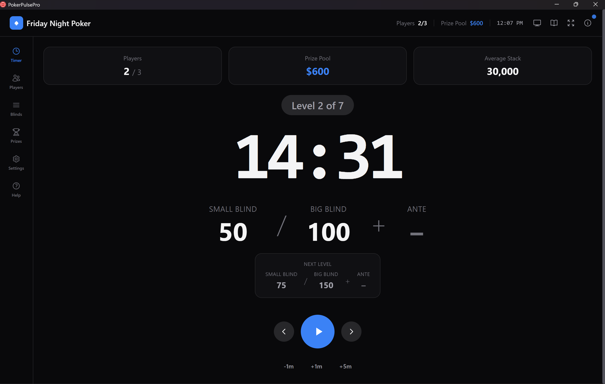

# PokerPulsePro Desktop

A beautiful, minimalistic poker tournament timer and manager built with Tauri (Rust) + React + TypeScript.

🌐 **[pokerpulsepro.com](https://pokerpulsepro.com)**




## ✨ Features

### Core Features
- **Tournament Timer** - Large, readable countdown with automatic level progression
- **Blind Structure** - Customizable blinds with templates (Turbo, Regular, Deep Stack)
  - **Custom Templates** - Save, load, import/export your own blind structures
  - **Generate by Duration** - Set target playtime (1-8 hours) and auto-generate structure
  - Active template indicator shows which structure is in use
- **Player Management** - Track buy-ins, rebuys, add-ons, and eliminations
  - **Multi-Table Support** - Random seating, table balancing, and seat assignments
- **Prize Calculator** - Automatic payout calculations with customizable splits
  - **Custom Templates** - Save, load, import/export your own prize structures
  - Active template indicator shows which structure is in use
- **Chip Breakdown** - Visual chip distribution suggestions
- **Chip Manager** - Define your physical chips and get distribution/color-up advice
- **Dark Mode** - Beautiful dark theme designed for visibility
- **Offline First** - Works without internet, data stored locally
- **Cross-Platform** - Windows, macOS, and Linux support

### New Features
- **🔊 Sound Alerts** - Configurable audio alerts between blind levels
  - Built-in sounds: Bell Ring, Evil Laugh
  - **Voice announcements** - Language-specific level change sounds (matches app language)
  - **Independent voice toggle** - Enable voice alongside any sound type
  - Custom sound file support (WAV, MP3, OGG, M4A)
  - Adjustable volume control
  - **Warning sounds** at 60 and 30 seconds before level change
  - Auto-pause on breaks option
- **💾 Auto-Save & Persistence** - Tournament progress automatically saved
  - Survives app restarts, window closes, and refreshes
  - Timer paused on restore to prevent missed time
  - Sound settings and tab position remembered
- **🖥️ Fullscreen Mode** - Native fullscreen support via Tauri window API
- **ℹ️ About Dialog** - Quick access to app info from the header
- **📊 Enhanced Timer Display** - Larger fonts with key stats always visible
  - Players remaining, Prize Pool, Average Stack, Next Level
  - Level indicator with bigger text
- **➕ Add-on Support** - Full add-on tracking alongside rebuys
  - Separate add-on amount and chip values
  - Included in prize pool and average stack calculations
- **📚 Help Page** - Poker hand rankings reference for beginners
  - Visual card examples for each hand type
  - Tips and common questions
- **⌨️ Keyboard Shortcuts** - Quick controls without mouse
  - Space: Play/Pause timer
  - Arrow keys: Navigate levels
  - +/-: Add/remove time
  - F11: Toggle fullscreen
  - Escape: Exit fullscreen
- **🎨 Color Themes** - Customizable appearance
  - Light and Dark mode toggle
  - 6 accent color options (Emerald, Blue, Purple, Rose, Amber, Cyan)
  - Smooth transitions between themes
- **🔀 Drag & Drop Blinds** - Reorder blind levels by dragging
- **🕐 Real-Time Clock** - Current time displayed on timer screen
- **📤 Export/Import** - Save and load tournament configurations
  - Export settings to JSON file for sharing
  - Import previously saved configurations
  - Works in both desktop app (native file dialog) and browser
- **📜 Tournament History** - Log of completed tournaments
  - Track winner, players, prize pool, and duration
  - View and manage past tournaments
  - Persistent storage between sessions
- **🪟 Custom Modal Dialogs** - Beautiful themed dialogs
  - Replaces native browser alerts/confirms/prompts
  - Matches app theme (light/dark mode + accent colors)
  - Backdrop blur, keyboard support, smooth animations
  - Persistent storage between sessions
- **🌍 Multilingual Support** - Full internationalization (i18n)
  - 6 languages: English, Spanish, German, French, Portuguese, Icelandic
  - Language selector in Settings
  - All UI components translated
- **🔄 Auto-Update** - Built-in update notifications
  - Checks for new versions automatically
  - One-click download and install
  - Signed releases for security
- **📺 Projector Mode** - Second screen support for TV/projector
  - Dedicated display window with giant timer
  - Syncs automatically with main window
  - Perfect for home games and tournaments
- **🎓 Interactive Onboarding** - Guided tutorial for new users
  - Step-by-step walkthrough of all features
  - Spotlight highlighting on UI elements
  - Accessible anytime from Settings or Help
- **🎰 Chip Manager** - Physical chip inventory with smart suggestions
  - Per-player distribution, shortage warnings, color-up schedule
  - Save/load custom chip sets alongside built-in presets
  - Color-up notifications on Timer screen (amber "now" / blue "next level")
- **🏆 Tournament Over Screen** - Automatic final standings when tournament ends
  - Winner announcement with trophy display and payout table
  - Save to History, New Tournament, and Undo options
  - Syncs to Projector with large-format winner display
- **👥 Quick Players Modal** - Manage players directly from the Timer screen
  - Eliminate, reinstate, add, or remove players without switching tabs
- **💰 Payout Dropdown on Timer** - Click Prize Pool card to view payout breakdown
- **🎨 Interactive Payout Structure** - Redesigned prize distribution
  - Draggable range sliders with auto-balancing (total stays at 100%)
  - Custom paid places: any number from 2-50
- **🕐 Time Format Toggle** - Switch between 12h (AM/PM) and 24h clock
- **🎯 Show/Hide Ante** - Toggle ante display on Timer and Projector

## 🚀 Quick Start

### Prerequisites

1. **Node.js** (v18 or later)
   ```bash
   # Check version
   node --version
   ```

2. **Rust** (latest stable)
   ```bash
   # Windows (via winget)
   winget install Rustlang.Rustup
   
   # macOS/Linux
   curl --proto '=https' --tlsv1.2 -sSf https://sh.rustup.rs | sh
   
   # Verify installation
   rustc --version
   ```

3. **Visual Studio Build Tools** (Windows only)
   - Install "Desktop development with C++" workload
   - For ARM64 Windows: Also install "MSVC v143 - VS 2022 C++ ARM64/ARM64EC build tools"

4. **System Dependencies** (Linux only)
   ```bash
   # Ubuntu/Debian
   sudo apt update
   sudo apt install libwebkit2gtk-4.1-dev build-essential curl wget file libssl-dev libayatana-appindicator3-dev librsvg2-dev
   
   # Fedora
   sudo dnf install webkit2gtk4.1-devel openssl-devel curl wget file
   
   # Arch
   sudo pacman -S webkit2gtk-4.1 base-devel curl wget file openssl
   ```

### Installation

```bash
# Clone or extract the project
cd pokerpulsepro-tauri

# Install dependencies
npm install

# Run in development mode
npm run tauri dev

# Build for production
npm run tauri build
```

## 📁 Project Structure

```
pokerpulsepro-tauri/
├── src/                    # React frontend
│   ├── components/         # UI components
│   │   ├── Timer.tsx       # Main timer display with stats bar
│   │   ├── Players.tsx     # Player management (buy-ins, rebuys, add-ons)
│   │   ├── Blinds.tsx      # Blind structure editor with drag & drop
│   │   ├── Prizes.tsx      # Payout calculator
│   │   ├── Settings.tsx    # Tournament, sound & theme settings
│   │   ├── Help.tsx        # Poker hand rankings reference
│   │   ├── Header.tsx      # App header with About dropdown
│   │   ├── Navigation.tsx  # Tab navigation (ARIA accessible)
│   │   ├── Onboarding.tsx  # Interactive tutorial overlay
│   │   ├── Modal.tsx       # Custom themed dialog system
│   │   └── ProjectorView.tsx # Projector/TV display component
│   ├── i18n/               # Internationalization
│   │   ├── index.ts        # i18n configuration
│   │   └── locales/        # Translation files (en, es, de, fr, pt, is)
│   ├── test/               # Test files (19 test suites)
│   ├── App.tsx             # Main app with persistence logic
│   ├── api.ts              # Tauri API bindings & mock data
│   ├── types.ts            # TypeScript definitions
│   ├── utils.ts            # Utility functions (prize pool, avg stack)
│   ├── main.tsx            # React entry point
│   ├── projector.tsx       # Projector window entry point
│   └── index.css           # Global styles
├── src-tauri/              # Rust backend
│   ├── src/
│   │   └── main.rs         # Tauri commands & state
│   ├── icons/              # App icons
│   ├── Cargo.toml          # Rust dependencies
│   └── tauri.conf.json     # Tauri configuration (with CSP)
├── public/                 # Static assets
│   └── alarms/             # Sound files
│       ├── bell-ring-01.wav
│       ├── evil-laugh.wav
│       └── localized/      # Voice announcements (en, es, de, fr, pt, is)
├── package.json            # Node dependencies
├── tailwind.config.js      # Tailwind CSS config
├── vite.config.ts          # Vite bundler config
├── vitest.config.ts        # Test configuration
└── README.md               # This file
```

## 🎮 Usage

### Timer Controls

| Action | Shortcut |
|--------|----------|
| Play/Pause | `Space` or click center button |
| Previous Level | `←` or left arrow button |
| Next Level | `→` or right arrow button |
| Add 1 minute | `+` or +1m button |
| Subtract 1 minute | `-` or -1m button |
| Add 5 minutes | +5m button |
| Fullscreen | `F11` or top-right button |
| Exit Fullscreen | `Escape` |

### Managing Players

1. Go to the **Players** tab
2. Enter a player name and click **Add Player**
3. Use +/- buttons to adjust buy-ins, rebuys, and add-ons
4. Click **Eliminate** when a player is knocked out
5. Placements are automatically assigned

### Sound Alerts

1. Go to the **Settings** tab
2. Find the "Level Change Sound" section
3. Toggle alerts on/off
4. Choose from built-in sounds or select a custom audio file
5. Adjust volume with the slider
6. Use "Test Sound" to preview
7. Enable **Warning Sounds** to hear beeps at 60s and 30s remaining
8. Enable **Auto-pause on breaks** to pause timer during breaks

### Customizing Blinds

1. Go to the **Blinds** tab
2. Choose a template (Turbo/Regular/Deep Stack) or customize
3. **Generate by Duration**: Click "⏱️ Generate by Duration", set hours (1-8), pick a style, and click Generate
4. Click ✎ to edit individual levels
5. Use ↑↓ buttons or **drag the ⋮⋮ handle** to reorder levels
6. Add breaks between levels as needed

### Prize Payouts

1. Go to the **Prizes** tab
2. Select number of paid places (2-8)
3. Adjust percentages if needed
4. View automatic payout calculations
5. Final standings update as players are eliminated
6. Prize pool includes buy-ins, rebuys, and add-ons

### Tournament Settings

Configure in the **Settings** tab:
- **Appearance** - Light/Dark mode and accent color selection
- **Currency** - USD, EUR, GBP, JPY, ISK, CAD, AUD
- **Buy-in Amount** - Entry fee
- **Rebuy Amount & Chips** - Cost and chips for rebuys
- **Add-on Amount & Chips** - Cost and chips for add-ons
- **Starting Chips** - Quick presets or custom amount
- **Sound Settings** - Level change sounds, warning beeps, volume
- **Chip Manager** - Define physical chips, get distribution and color-up advice

### Data Persistence

Your tournament data is automatically saved to local storage:
- All player data, eliminations, and placements
- Current blind level and time remaining
- Sound settings and preferences
- Theme settings (mode and accent color)
- Survives app restarts and refreshes
- Use "Reset Tournament" in Settings to start fresh

### Help & Hand Rankings

New to poker? Go to the **Help** tab to see:
- All poker hand rankings from Royal Flush to High Card
- Visual card examples for each hand
- Quick tips for beginners

## 🛠️ Development

### Running in Development

```bash
npm run tauri dev
```

This starts both the Vite dev server and the Tauri application with hot-reload.

### Building for Production

```bash
npm run tauri build
```

Builds are output to `src-tauri/target/release/bundle/`:
- **Windows**: `.msi` and `.exe`
- **macOS**: `.dmg` and `.app`
- **Linux**: `.deb`, `.rpm`, and `.AppImage`

### Running Tests

```bash
# Run all tests
npm test

# Run tests with coverage report
npm run test:coverage

# Run tests in watch mode
npm run test:watch
```

926 tests across 19 test suites with 78% code coverage.

### Frontend Only (Web)

```bash
npm run dev
```

The app works as a web app too, using mock data when Tauri isn't available.

## 🎨 Customization

### Colors

Edit `tailwind.config.js` to customize the color scheme:

```js
colors: {
  felt: { ... },  // Table felt greens
  gold: { ... },  // Accent gold
}
```

### Blind Templates

Edit the templates in `src/components/Blinds.tsx`:

```typescript
const templates = {
  turbo: [...],
  regular: [...],
  deep: [...],
}
```

## 📝 License

MIT License - feel free to use this for your home games!

## 🤝 Contributing

Contributions welcome! Please open an issue or PR.

## 📋 Changelog

### v1.2.2
- **🔧 Fix Stale Update Cache** - No longer shows outdated versions as available updates
  - Cached update info is invalidated when current version is already up-to-date
  - Prevents showing a "downgrade" as an available update after upgrading

### v1.2.1
- **🔧 Fix Update Button** - In-app "Download Update" now works reliably
  - Fixed issue where cached update info lost the download object
  - Re-checks with Tauri updater when user clicks Download Update
- **�📄 README** - Added app preview image and homepage link
- **⚙️ CI** - Updated GitHub Actions to Node.js 22 and actions v5

### v1.2.0 
- **🎰 Chip Manager** - Define your physical chip inventory and get smart suggestions
  - Add chips with denomination, quantity, color, and label
  - Quick setup presets: Standard (5 colors), Small Set (4), Large Set (6)
  - Per-player distribution calculated from starting chips and player count
  - Shortage warnings when you don't have enough chips
  - Color-up schedule shows when each denomination can be removed based on blind structure
  - Color-up notifications on the Timer screen: amber "Color up now" banner at the color-up level, blue "Color up next level" preview one level ahead
  - Save custom chip sets with names for quick loading
  - Custom sets persisted alongside built-in presets
  - Persistent across sessions via localStorage
- **🔊 Voice Announcements Toggle** - Independent voice announcement control
  - Dedicated enable/disable toggle separate from level change sound type
  - Play voice announcements alongside any sound (Bell, Evil Laugh, Custom)
  - "Test Voice" button to preview in your current language
  - Voice delayed 500ms to avoid overlap with primary sound
- **🎨 Improved Payout Structure** - Interactive prize distribution redesign
  - Visual stacked bar showing all places as colored segments
  - Draggable range sliders per place with auto-balancing (total stays at 100%)
  - Custom styled increment/decrement buttons with inline % symbol
  - Custom paid places: type any number (2-50) beyond the preset 2-8 buttons
  - Auto-generated top-heavy distributions for custom place counts
- **🕐 Time Format Toggle** - 12h (AM/PM) or 24h clock display
  - Toggle in Appearance settings alongside language and theme
  - Applied to the header clock in real-time
- **🎯 Show/Hide Ante** - Toggle ante display on timer screen
  - Option in Tournament Settings to disable ante column
  - Hides ante from both Timer and Projector views
- **� Tournament Over Screen** - Automatic final standings when tournament ends
  - Triggers when 1 or 0 players remain (winner detected or all eliminated)
  - Winner announcement with trophy display
  - Final standings table with place medals (🥇🥈🥉) and payouts
  - Save to History and New Tournament buttons
  - Undo elimination option if triggered by mistake
  - Syncs to Projector screen with large-format winner display
- **👥 Quick Players Modal** - Manage players directly from the Timer screen
  - Click the Players stat card to open a quick-access modal
  - Add new players, eliminate active players, reinstate eliminated ones
  - Active players shown first, eliminated below with strikethrough
  - No need to switch tabs during gameplay
- **💰 Payout Dropdown on Timer** - View payout structure without leaving the timer
  - Click the Prize Pool card to toggle a payout breakdown
  - Shows each place's percentage and calculated payout amount
  - Payout config persisted in localStorage and synced with Prizes tab
- **�🎛️ Settings Layout Optimization** - Better use of screen space
  - Chip Manager split into 2-column layout (inventory + distribution)
  - Help & Support and Danger Zone combined side-by-side
  - Consistent control heights across Appearance section
- **🎓 Interactive Onboarding** - Guided tutorial for new users
  - Step-by-step walkthrough of all app features
  - Spotlight highlighting shows exactly where each feature is
  - 9 steps covering Timer, Players, Blinds, Prizes, Settings, Projector, and Fullscreen
  - Skip option to exit early, or restart anytime from Settings/Help
  - Automatically shows on first launch for new users
- **⏱️ Generate by Duration** - Auto-generate blind structures based on target playtime
  - Set tournament duration from 1-8 hours with a slider
  - Choose level style: Turbo (10m), Regular (15m), or Deep (20m)
  - Preview shows levels and breaks before generating
  - Automatic blind progression with antes introduced mid-tournament
  - Breaks inserted at appropriate intervals based on style
- **🎰 Multi-Table Support** - Table assignment and balancing for larger tournaments
  - Configure number of tables (1-20) and seats per table (2-10)
  - Random seat assignment using fair snake draft algorithm
  - List view and Table view modes for player management
  - Balance warnings when tables become uneven after eliminations
  - One-click balance suggestions to move players between tables
  - Table/seat badges displayed on player cards (T1-S3 format)
- **💰 Prize Structure Templates** - Save and reuse custom payout structures
  - Save current prize distribution as a reusable template
  - Import/Export templates as JSON files for sharing
  - "My Templates" library for quick loading
  - Active template indicator with one-click clear
  - Supports 2-50 paid places with custom percentages
- **🔒 Security Hardening** - Content Security Policy (CSP) configuration
  - Restrictive CSP rules in Tauri configuration
  - Limits script, style, image, and network sources
  - Protects against XSS and injection attacks
- **♿ Accessibility (a11y)** - ARIA attributes across all components
  - `role="tablist"` / `role="tab"` with `aria-selected` on navigation
  - `role="timer"` with `aria-live="assertive"` on countdown display
  - `role="banner"` with labeled icon buttons on header
  - `aria-expanded` / `aria-haspopup` on dropdown triggers
  - `aria-hidden="true"` on decorative SVG icons
  - Screen reader friendly button labels throughout
- **🧪 Comprehensive Test Suite** - 926 tests with 78% coverage
  - Vitest + React Testing Library with v8 coverage
  - 19 test files covering all major components
  - Tests for: App, Timer, Players, Blinds, Prizes, Settings, Header, Help, Modal, Navigation, ProjectorView, Onboarding
  - Utility tests for: api, utils, types, tournament, persistence, i18n, multiTable
  - 100% coverage on Help, Modal, Navigation, i18n
  - Run tests with `npm test` or `npm run test:coverage`
- **🧹 Code Quality** - Production readiness improvements
  - Removed all debug `console.log` statements
  - Clean console output in production builds
  - TypeScript strict mode with zero errors

### v1.1.0
- **🌍 Multilingual Support** - Full internationalization (i18n) with 6 languages
  - English, Spanish, German, French, Portuguese, Icelandic
  - Language selector in Settings
  - All UI components translated
- **🔄 Auto-Update** - Built-in update notifications and installer
  - Automatic version checking via GitHub Releases
  - One-click download and install updates
  - Signed builds for security
- **🔗 Website Link** - Quick access to pokerpulsepro.com from About dialog
- **📁 Custom Blind Templates** - Save, manage, and share blind structures
  - Save current structure as a reusable template
  - Import/Export templates as JSON files
  - "My Templates" library for quick access
  - Active template indicator with one-click clear
  - Improved drag & drop visual feedback with accent color
- **📺 Projector Mode** - Second screen support for TV/projector display
  - Open dedicated display window for large screens
  - Giant timer readable from 50+ feet
  - Syncs automatically with main control window
  - Fullscreen support on secondary monitors
  - Shows blinds, players, prize pool, and next level
  - Running/paused indicator visible to all players

### v1.0.0
- Initial release with timer, blinds, players, and prizes
- **🔊 Sound Alerts** - Configurable audio alerts between blind levels
- **💾 Auto-Save** - Tournament progress automatically saved
- **➕ Add-on Support** - Full add-on tracking alongside rebuys
- **🖥️ Fullscreen Mode** - Native fullscreen support via Tauri window API
- **📊 Enhanced Timer Display** - Larger fonts with key stats always visible
- **🎨 Theme System** - Light/Dark mode with 6 accent colors
- **📚 Help Page** - Poker hand rankings reference
- **⌨️ Keyboard Shortcuts** - Space, arrows, +/-, F11, Escape
- **🔔 Warning Sounds** - Beeps at 60s and 30s before level change
- **⏸️ Auto-pause on Breaks** - Timer pauses automatically during breaks
- **🔀 Drag & Drop Blinds** - Reorder levels by dragging
- **📤 Export/Import** - Save and load tournament configurations
- **📜 Tournament History** - Log of completed tournaments
- **🪟 Custom Modal Dialogs** - Beautiful themed dialogs

---

Built with ❤️ for poker enthusiasts
